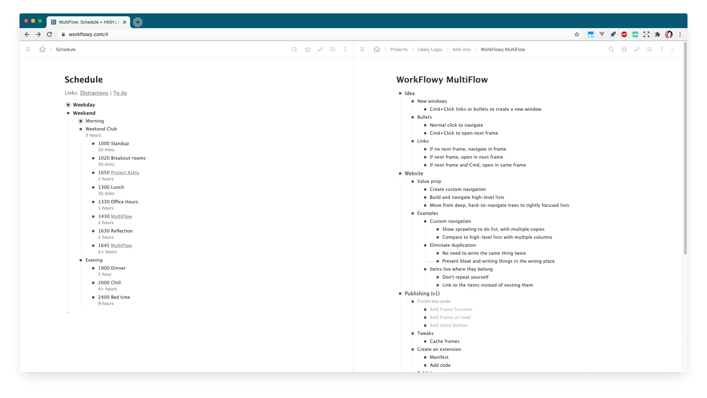

# WorkFlowy MultiFlow

> Columns view for Workflowy




## Intro

WorkFlowy MultiFlow adds a multi-column view to WorkFlowy, which enables you to maintain an overview over several trees at once, or refactor longer lists by copying and pasting between two columns, instead of scrolling up and down in a single window.

Columns are opened by Cmd/Ctrl+Clicking on:

- bullets
- links to other pages
- the breadcrumbs' page title

You can open and close as many columns as you require, and change the layout by clicking on the toolbar icon and selecting the layout from the popup.

When you first click the icon your previous session will be loaded so you can start where you left off.

Click here for a [video](https://www.youtube.com/watch?v=Iy1DuGjUhR4).


## Development

The extension is not compiled, so all JavaScript will just run as-is.


## Releasing

To release, update the `src/manifest.json` version field, and run:
```
npm run release
```

A zip file will be saved to `../releases`.

Upload this file to the [Chrome Developer Dashboard](https://chrome.google.com/webstore/devconsole/8051cfa9-44b7-4869-9a94-1843ebf8c388?hl=en-GB) and publish using the tools provided.


## Assets

The file `assets/multiflow.sketch` is a [Sketch](https://www.sketch.com/) file containing the icons and UI images for the extension.


## Links

- [Chrome Web Store](https://chrome.google.com/webstore/detail/workflowy-multiflow/khjdmjcmpolknpccmaaipmidphjokhdf)
- [Product Hunt](https://www.producthunt.com/posts/workflowy-multiflow)
- [Reddit](https://www.reddit.com/r/Workflowy/comments/l9eoqz/workflowy_multiflow_navigate_organise_maintain/)
